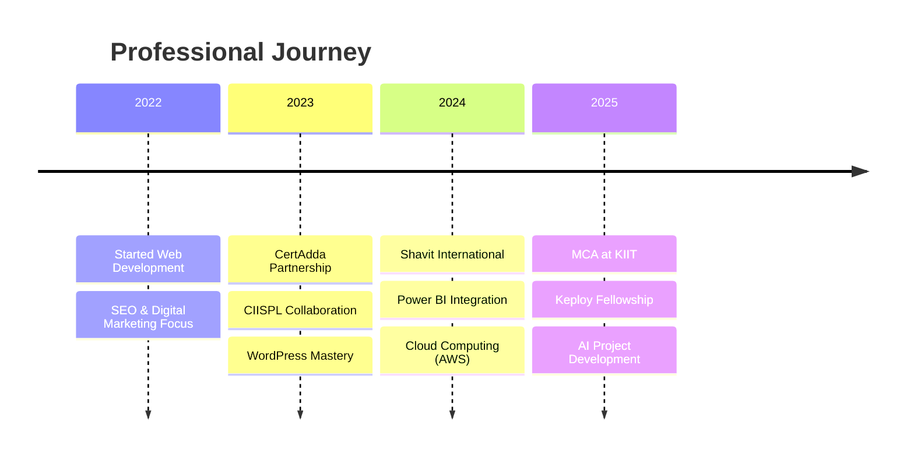

# <div align="center"></div>

<div align="center">

<!-- Holographic typing effect -->
[](https://git.io/typing-svg)

<!-- Floating badges with glow effect -->
<p align="center">
  
  
  
</p>

<!-- Animated profile views counter -->


<!-- Social media matrix -->
<p align="center">
<a href="mailto:rahulkr.tech247@gmail.com"></a>
<a href="https://linkedin.com/in/your-profile"></a>
<a href="https://github.com/codexrahulKIIT"></a>
<a href="#"></a>
</p>

</div>

---

<div align="center">

## ⚡ DIGITAL ARCHITECT & CODE WIZARD ⚡

</div>


```yaml
class RahulKumar:
    def __init__(self):
        self.name = "Rahul Kumar"
        self.role = "MCA Student & Software Engineer"
        self.location = "KIIT, Bhubaneswar 🏛️"
        self.experience = "2+ Years"
        self.companies = ["CertAdda", "CIISPL", "Shavit International"]
        
    def get_current_focus(self):
        return [
            "🎯 Keploy API Fellowship",
            "☁️ AWS Cloud Mastery",
            "🤖 AI Integration Projects",
            "🌟 Open Source Contributions"
        ]
        
    def get_superpowers(self):
        return {
            "languages": ["Python", "Java", "JavaScript", "SQL"],
            "frontend": ["React.js", "HTML5", "CSS3", "WordPress"],
            "backend": ["Node.js", "RESTful APIs", "Microservices"],
            "cloud": ["AWS EC2", "S3", "IAM", "Lambda"],
            "data": ["Power BI", "Pandas", "NumPy", "Matplotlib"],
            "tools": ["Git", "Linux", "Docker", "Postman"]
        }
```

<br clear="right"/>

---

<div align="center">

## 🎨 TECHNOLOGY UNIVERSE 🎨

</div>

<div align="center">

### 🧠 Programming Languages
<p>
  
</p>

### 🎨 Frontend Development
<p>
  
</p>

### ⚙️ Backend & Database
<p>
  
</p>

### ☁️ Cloud & DevOps
<p>
  
</p>

### 📊 Data & Analytics
<p>
  
  
  
  
</p>

</div>

---

<div align="center">

## 🚀 MISSION-CRITICAL PROJECTS 🚀

</div>

<table>
<tr>
<td width="50%">

### 🤖 **HealthBite** `🔥 In Development`


🎯 **Revolutionary AI-powered food recommendation system**
- 🧠 **Smart chatbot** with personalized health insights  
- 🍎 **ML-driven nutrition** analysis and suggestions  
- 🛒 **E-commerce integration** for seamless shopping  
- 📊 **Real-time health tracking** and recommendations  

**Tech Arsenal:**
```bash
🐍 Python | 🤖 AI/ML | 🌐 APIs | 🗄️ Database
```

</td>
<td width="50%">

### 🌤️ **Weather Dashboard** `✨ Live`


⚡ **Next-gen weather intelligence platform**  
- 📱 **Ultra-responsive React.js** architecture  
- 🌍 **Real-time global weather** via OpenWeatherMap  
- 🎨 **Stunning UI/UX** with smooth animations  
- 🔍 **Advanced error handling** & data validation  

**Tech Arsenal:**
```bash
⚛️ React.js | 🌐 APIs | 🎨 CSS3 | ⚡ JavaScript
```

**[🔗 Explore Live Demo](https://github.com/codexrahulKIIT/React-weather-dashboard)**

</td>
</tr>
</table>

---

<div align="center">

## 📊 PERFORMANCE METRICS & BATTLE STATS 📊

</div>

<div align="center">


</div>

---

<div align="center">

## 🎯 CURRENT MISSION STATUS 🎯

</div>

<table align="center">
<tr>
<td align="center" width="33%">

### 🏆 **Keploy API Fellowship**


🔧 **Contributing to cutting-edge testing tools**  
🚀 **Building next-gen API solutions**  
🌟 **Collaborating with industry experts**

</td>
<td align="center" width="33%">

### 🌟 **Open Source Impact**


📈 **Growing GitHub presence daily**  
🤝 **Community-driven development**  
💡 **Innovative project contributions**

</td>
<td align="center" width="33%">

### ⚡ **Skill Evolution**


☁️ **AWS Cloud Architecture mastery**  
🏗️ **Backend system optimization**  
🤖 **AI/ML integration expertise**

</td>
</tr>
</table>

---

<div align="center">

## 🎨 PROFESSIONAL ACHIEVEMENT GALLERY 🎨

</div>

<div align="center">

### 💼 **Industry Experience Timeline**



</div>

---

<div align="center">

## 🌟 INNOVATION SHOWCASE 🌟

</div>

<div align="center">

### 🔥 **Core Competencies Matrix**

| 🎯 **Domain** | 🚀 **Expertise Level** | 🛠️ **Key Technologies** | 📈 **Impact** |
|:---:|:---:|:---:|:---:|
| **Frontend Development** | ████████░░ 80% | React.js, HTML5, CSS3, JavaScript | 🌟 User-Centric Design |
| **Backend Architecture** | ███████░░░ 70% | Node.js, APIs, Microservices | ⚡ Scalable Solutions |
| **Cloud Computing** | ██████░░░░ 60% | AWS EC2, S3, IAM, Lambda | ☁️ Infrastructure Mastery |
| **Data Analytics** | ████████░░ 80% | Power BI, Python, Pandas | 📊 Data-Driven Insights |
| **SEO & Marketing** | █████████░ 90% | WordPress, Analytics, Performance | 📈 Growth Optimization |

</div>

---

<div align="center">

## 🎊 CONNECT WITH THE DIGITAL ARCHITECT 🎊

</div>

<div align="center">

### 💫 **Let's Build Something Amazing Together!** 💫


<table>
<tr>
<td align="center">

### 📬 **Direct Communication**
<a href="mailto:rahulkr.tech247@gmail.com">

</a>

*Quick response guaranteed!*

</td>
<td align="center">

### 💼 **Professional Network**
<a href="https://linkedin.com/in/your-profile">

</a>

*Let's grow together professionally!*

</td>
<td align="center">

### 🌐 **Code Universe**
<a href="https://github.com/codexrahulKIIT">

</a>

*Join the coding adventure!*

</td>
</tr>
</table>

---

### 🎯 **What I'm Looking For:**
- 🚀 **Exciting project collaborations**
- 🌟 **Open source contribution opportunities**  
- 💡 **Innovative startup partnerships**
- 🎓 **Mentorship and learning experiences**
- 🤝 **Tech community connections**

---

<div align="center">


### 🌟 *"Code is not just my profession, it's my passion for creating digital magic!"* 🌟

</div>

---


</div>


---

<div align="center">

**🚀 Built with 💙 by Rahul Kumar | Last Updated: July 2025 🚀**

</div>
